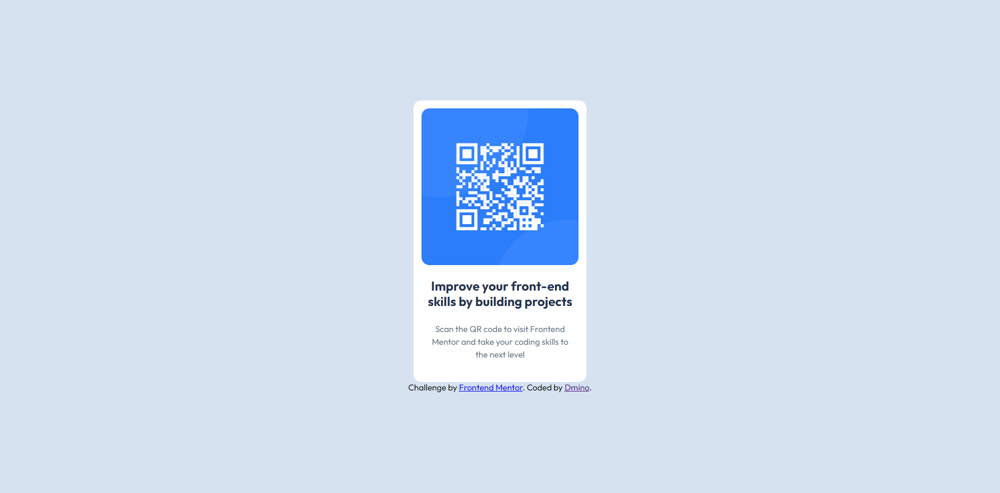

# Frontend Mentor - QR code component solution

This is a solution to the [QR code component challenge on Frontend Mentor](https://www.frontendmentor.io/challenges/qr-code-component-iux_sIO_H). Frontend Mentor challenges help you improve your coding skills by building realistic projects. 

## Table of contents

- [Overview](#overview)
  - [Screenshot](#screenshot)
  - [Links](#links)
- [My process](#my-process)
  - [Built with](#built-with)
  - [What I learned](#what-i-learned)
  - [Continued development](#continued-development)
  - [Useful resources](#useful-resources)
- [Author](#author)
- [Acknowledgments](#acknowledgments)

## Overview

The QR code component coding challenge.

### Screenshot

### Links

- Solution URL: [Add solution URL here](https://your-solution-url.com)
- Live Site URL: [Add live site URL here](https://your-live-site-url.com)

## My process

### Built with

- Semantic HTML5 markup
- CSS custom properties
- Flexbox

### What I learned

### Continued development

I will try more challenging projects and practice js frameworks (mostly [Next.js](https://nextjs.org)).

### Useful resources

## Author

- Frontend Mentor - [@Dmino228](https://www.frontendmentor.io/profile/Dmino228)
- Twitter - [@Dmino228](https://x.com/Dmino228)
- Discord - [@Dmino](discord.com/users/450691197522935818)

## Acknowledgments